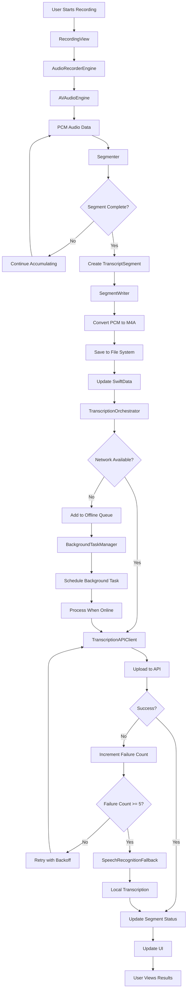

# Architecture Documentation

## Overview

TwinMindAssignment follows Clean Architecture principles with a clear separation of concerns across multiple layers. The application is built using SwiftUI, Combine, and SwiftData, implementing SOLID principles through protocol-oriented design and dependency injection.

## Clean Architecture Layers

### 🏗️ Presentation Layer (UI)
- **SwiftUI Views**: `RecordingView`, `SessionsListView`, `SessionDetailView`, `SettingsView`
- **ViewModels**: `RecordingViewModel`, `SessionsListViewModel`, `SessionDetailViewModel`, `SettingsViewModel`
- **State Management**: `@StateObject`, `@Published` properties, Combine publishers

### 🔧 Features Layer
- **User Interface Components**: `StatusChip`, `ShareSheet`
- **Feature Services**: `PermissionManager`, `ErrorPresenter`, `ExportService`, `Analytics`
- **Environment Management**: `EnvironmentHolder` with protocol-based dependencies

### 🧠 Core Layer
- **Orchestration**: `TranscriptionOrchestrator`, `BackgroundTaskManager`, `Reachability`
- **Segmentation**: `Segmenter`, `SegmentWriter`
- **Network**: `TranscriptionAPIClient`, `TokenManager`, `MultipartBodyBuilder`
- **Fallback**: `SpeechRecognitionFallback`

### 💾 Data Layer
- **Models**: `RecordingSession`, `TranscriptSegment` (SwiftData)
- **Repositories**: `RecordingSessionRepository`, `TranscriptSegmentRepository`
- **Data Stack**: `SwiftDataStack`
- **Local Storage**: File system for audio segments, SwiftData for metadata

## Class Diagram

```mermaid
classDiagram
    %% Presentation Layer
    class RecordingView {
        +@StateObject viewModel: RecordingViewModel
        +@Environment environmentHolder: EnvironmentHolder
    }
    
    class SessionsListView {
        +@StateObject viewModel: SessionsListViewModel
        +@Environment environmentHolder: EnvironmentHolder
    }
    
    class SessionDetailView {
        +@StateObject viewModel: SessionDetailViewModel
        +@Environment environmentHolder: EnvironmentHolder
    }
    
    %% ViewModels
    class RecordingViewModel {
        +@Published isRecording: Bool
        +@Published recordingLevel: Float
        +@Published currentRoute: String
        +setupSubscriptions()
        +startRecording()
        +stopRecording()
    }
    
    class SessionsListViewModel {
        +@Published sessions: [RecordingSession]
        +@Published searchQuery: String
        +@Published isLoading: Bool
        +loadSessions()
        +performSearch()
    }
    
    %% Environment Holder
    class EnvironmentHolder {
        +@Published recordingSessionRepository: RecordingSessionRepositoryProtocol
        +@Published transcriptSegmentRepository: TranscriptSegmentRepositoryProtocol
        +@Published audioRecorder: AudioRecorderProtocol
        +@Published transcriptionOrchestrator: TranscriptionOrchestratorProtocol
        +static createDefault() -> EnvironmentHolder
        +static createForPreview() -> EnvironmentHolder
    }
    
    %% Core Services
    class TranscriptionOrchestrator {
        +@Published isRunning: Bool
        +@Published queueStatus: QueueStatus
        +eventsPublisher: AnyPublisher<OrchestratorEvent, Never>
        +start()
        +stop()
        +processPendingSegments()
    }
    
    class Segmenter {
        +segmentClosedPublisher: AnyPublisher<TranscriptSegment, Never>
        +startRecording(sessionID: UUID)
        +stopRecording()
        +addPCMData(_: Data)
        +acceptDummySamples(duration: TimeInterval)
    }
    
    class SegmentWriter {
        +writeSegment(pcmData: Data, sessionID: UUID, index: Int, sampleRate: Double, channelCount: Int) -> URL?
        -hasSufficientFreeSpace() -> Bool
        -applyCompleteFileProtection(to: URL)
    }
    
    %% Network Layer
    class TranscriptionAPIClient {
        +transcribe(fileURL: URL, sessionID: UUID, segmentIndex: Int) -> AnyPublisher<TranscriptionResult, APIError>
        -createTranscriptionRequest() -> URLRequest?
        -validateResponse() -> Data
    }
    
    class TokenManager {
        +storeToken(_: String) -> Bool
        +retrieveToken() -> String?
        +hasValidToken: Bool
        +isValidToken(_: String) -> Bool
    }
    
    %% Data Models
    class RecordingSession {
        +id: UUID
        +title: String
        +notes: String
        +startTime: Date
        +endTime: Date?
        +@Relationship segments: [TranscriptSegment]
    }
    
    class TranscriptSegment {
        +id: UUID
        +sessionID: UUID
        +index: Int
        +startTime: TimeInterval
        +duration: TimeInterval
        +audioFileURL: URL?
        +transcriptText: String?
        +status: SegmentStatus
        +failureCount: Int
    }
    
    %% Protocols
    class RecordingSessionRepositoryProtocol {
        <<interface>>
        +fetchSessions() -> AnyPublisher<[RecordingSession], Error>
        +createSession(_: RecordingSession) -> AnyPublisher<RecordingSession, Error>
        +updateSession(_: RecordingSession) -> AnyPublisher<RecordingSession, Error>
        +deleteSession(_: RecordingSession) -> AnyPublisher<Void, Error>
    }
    
    class AudioRecorderProtocol {
        <<interface>>
        +recordingStatePublisher: AnyPublisher<RecordingState, Never>
        +levelPublisher: AnyPublisher<Float, Never>
        +routePublisher: AnyPublisher<String, Never>
        +startRecording() -> AnyPublisher<Void, Error>
        +stopRecording() -> AnyPublisher<Void, Error>
    }
    
    %% Relationships
    RecordingView --> RecordingViewModel
    SessionsListView --> SessionsListViewModel
    SessionDetailView --> SessionDetailViewModel
    
    RecordingViewModel --> EnvironmentHolder
    SessionsListViewModel --> EnvironmentHolder
    SessionDetailViewModel --> EnvironmentHolder
    
    EnvironmentHolder --> RecordingSessionRepositoryProtocol
    EnvironmentHolder --> AudioRecorderProtocol
    EnvironmentHolder --> TranscriptionOrchestratorProtocol
    
    TranscriptionOrchestrator --> TranscriptionAPIClient
    TranscriptionOrchestrator --> Segmenter
    TranscriptionOrchestrator --> BackgroundTaskManager
    
    Segmenter --> SegmentWriter
    SegmentWriter --> RecordingSession
    
    TranscriptionAPIClient --> TokenManager
    TranscriptionAPIClient --> MultipartBodyBuilder
```



## Data Flow Diagram



## Technology Usage

### Combine Framework
- **Publishers**: `AnyPublisher<Output, Failure>` for reactive data flow
- **Subscribers**: `sink()` for handling published values
- **Operators**: Custom `retryBackoff` operator for API resilience
- **Schedulers**: `DispatchQueue.main` for UI updates, custom `TestScheduler` for testing

### SwiftUI
- **Views**: Declarative UI components with `@StateObject` and `@Environment`
- **Navigation**: `NavigationView`, `NavigationLink` for app flow
- **State Management**: `@Published` properties with Combine integration
- **Environment**: Dependency injection through `EnvironmentHolder`

### SwiftData
- **Models**: `@Model` classes for persistent data
- **Relationships**: `@Relationship` for model associations
- **Queries**: SwiftData query syntax for data retrieval
- **Context**: `ModelContext` for data operations

### Async/Await
- **Background Tasks**: `BGProcessingTask` for offline processing
- **File Operations**: Asynchronous file I/O operations
- **Network Requests**: URLSession with async/await patterns

## Dependency Injection

The application uses protocol-based dependency injection through the `EnvironmentHolder`:

```swift
class EnvironmentHolder: ObservableObject {
    @Published var recordingSessionRepository: RecordingSessionRepositoryProtocol
    @Published var transcriptSegmentRepository: TranscriptSegmentRepositoryProtocol
    @Published var audioRecorder: AudioRecorderProtocol
    @Published var transcriptionOrchestrator: TranscriptionOrchestratorProtocol
    
    static func createDefault() -> EnvironmentHolder
    static func createForPreview() -> EnvironmentHolder
}
```

This pattern enables:
- **Testability**: Easy substitution with fake implementations
- **Modularity**: Clear separation of concerns
- **Flexibility**: Runtime configuration of dependencies
- **Preview Support**: SwiftUI previews with mock data

## Room for Improvement

### Current Limitations
1. **Background Audio**: Limited background recording capabilities
2. **Offline Storage**: No local transcription result caching
3. **Error Recovery**: Basic retry logic without sophisticated recovery
4. **Performance**: No audio compression or optimization

### Architectural Enhancements
1. **Modularization**: Extract features into separate Swift packages
2. **Caching Layer**: Implement sophisticated caching strategy
3. **Event Sourcing**: Add event store for audit trail
4. **Plugin Architecture**: Support for custom transcription providers

### Future Scope
1. **Multi-Platform**: macOS and watchOS support
2. **Cloud Sync**: iCloud integration for cross-device data
3. **Advanced Analytics**: User behavior and performance metrics
4. **Machine Learning**: On-device audio classification
5. **Real-time Collaboration**: Shared recording sessions 