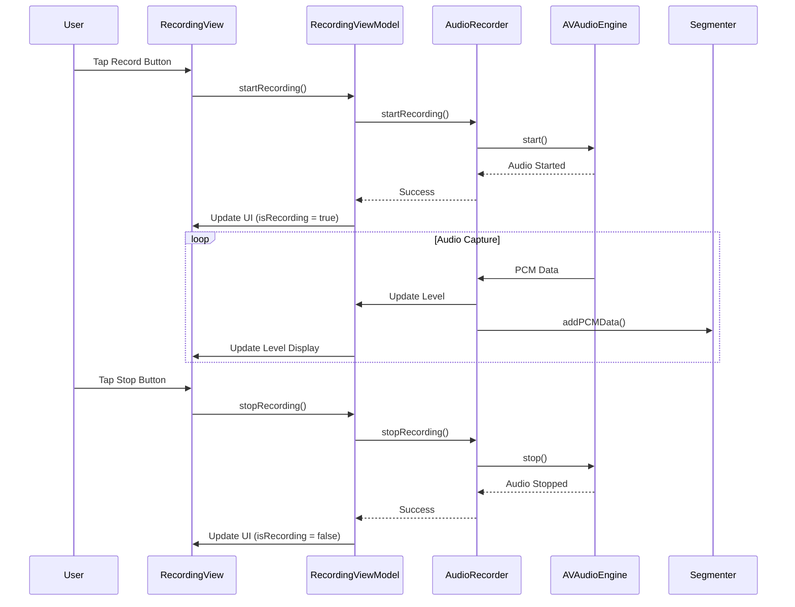
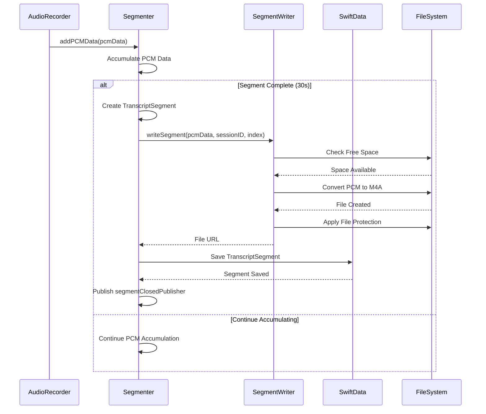
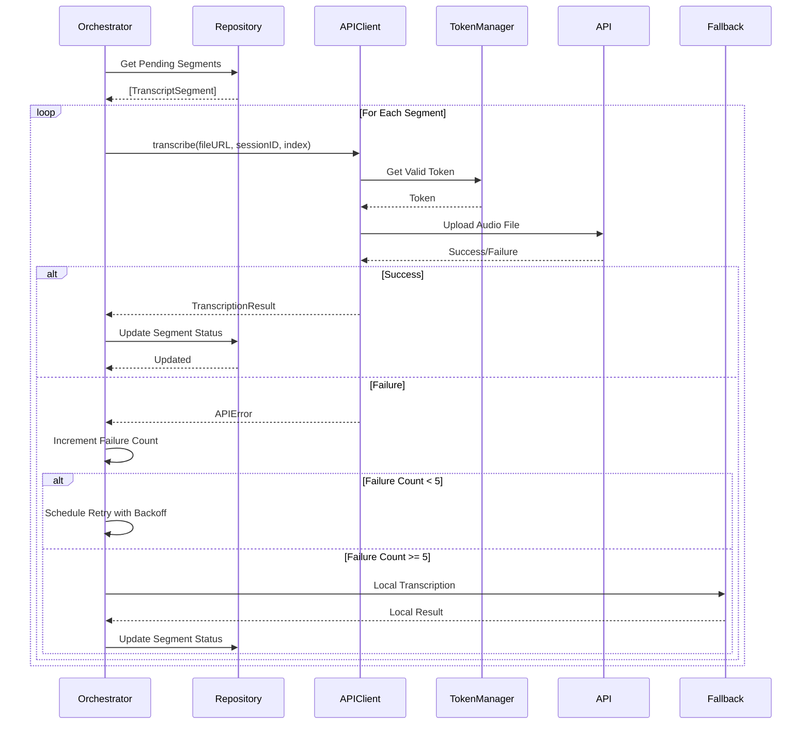
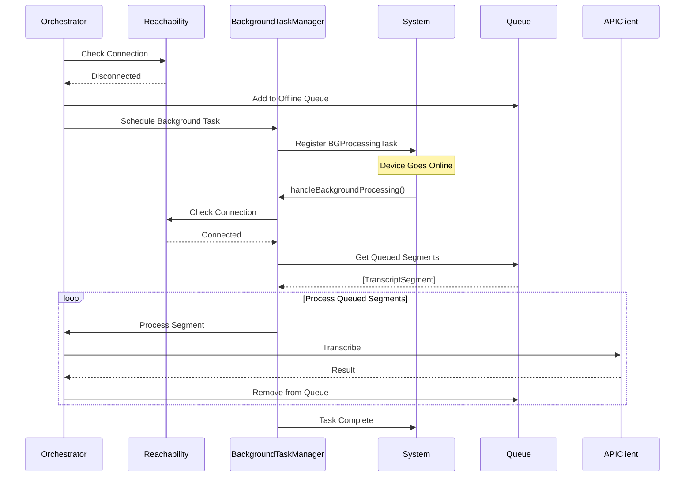
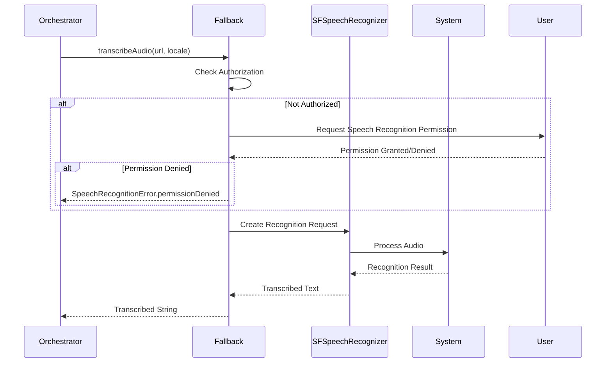
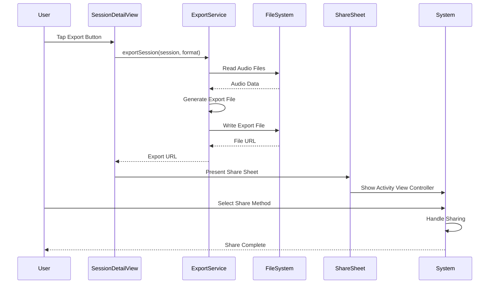
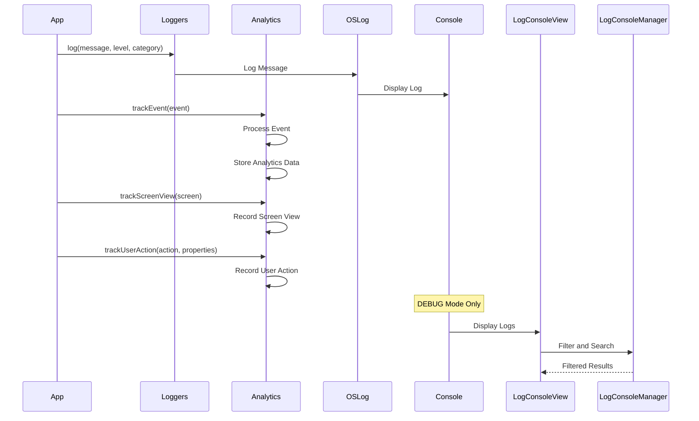

# Features Documentation

## Overview

This document provides detailed information about each feature in the TwinMindAssignment application, including their purpose, public APIs, runtime interactions, and current implementation status.

## 🎙️ Recording Feature

### Purpose and Behavior
The Recording feature captures audio input from the device microphone, processes it in real-time, and creates segmented audio files. It provides visual feedback for recording levels and device routing information.

### Public APIs

#### RecordingView
```swift
struct RecordingView: View {
    @StateObject private var viewModel: RecordingViewModel
    @Environment(\.environmentHolder) var environmentHolder
    
    var body: some View
}
```

#### RecordingViewModel
```swift
@MainActor
final class RecordingViewModel: ObservableObject {
    @Published var isRecording: Bool = false
    @Published var recordingLevel: Float = 0.0
    @Published var currentRoute: String = "Unknown"
    
    func startRecording() -> AnyPublisher<Void, Error>
    func stopRecording() -> AnyPublisher<Void, Error>
    private func setupSubscriptions()
}
```

#### AudioRecorderProtocol
```swift
protocol AudioRecorderProtocol: ObservableObject {
    var recordingStatePublisher: AnyPublisher<RecordingState, Never> { get }
    var levelPublisher: AnyPublisher<Float, Never> { get }
    var routePublisher: AnyPublisher<String, Never> { get }
    
    func startRecording() -> AnyPublisher<Void, Error>
    func stopRecording() -> AnyPublisher<Void, Error>
}
```

### Sequence Diagram



### Current Implementation Notes
- **Audio Engine**: Uses `AVAudioEngine` with `AVAudioInputNode`
- **Level Monitoring**: Real-time audio level monitoring via `AVAudioInputNode.installTap`
- **Route Detection**: Monitors audio route changes via `AVAudioSession.routeChangeNotification`
- **Error Handling**: Comprehensive error handling with user-friendly messages
- **State Management**: Reactive state updates using Combine publishers

### Room for Improvement
1. **Background Recording**: Limited background audio capabilities
2. **Audio Quality**: No configurable sample rate or bit depth
3. **Noise Reduction**: No built-in audio preprocessing
4. **Multiple Inputs**: No support for external audio interfaces

### Future Scope
1. **Background Audio**: Full background recording support
2. **Audio Effects**: Real-time audio processing and effects
3. **Quality Settings**: Configurable audio quality options
4. **External Devices**: Support for Bluetooth and USB audio devices

## ✂️ Segmentation Feature

### Purpose and Behavior
The Segmentation feature automatically divides continuous audio recordings into manageable segments (default: 30 seconds). It creates `TranscriptSegment` entities and saves audio files to the local file system.

### Public APIs

#### Segmenter
```swift
final class Segmenter: ObservableObject {
    var segmentClosedPublisher: AnyPublisher<TranscriptSegment, Never> { get }
    
    func startRecording(sessionID: UUID)
    func stopRecording()
    func addPCMData(_ data: Data)
    func acceptDummySamples(duration: TimeInterval)
}
```

#### SegmentWriter
```swift
final class SegmentWriter {
    func writeSegment(
        pcmData: Data,
        sessionID: UUID,
        index: Int,
        sampleRate: Double,
        channelCount: Int
    ) -> URL?
    
    private func hasSufficientFreeSpace() -> Bool
    private func applyCompleteFileProtection(to url: URL)
}
```

### Sequence Diagram



### Current Implementation Notes
- **Segment Duration**: Configurable segment length (default: 30 seconds)
- **File Format**: Converts PCM to M4A for efficient storage
- **File Protection**: Applies complete file protection to audio files
- **Space Management**: Checks available disk space before writing
- **Directory Structure**: `<AppSupport>/Recordings/<sessionID>/<index>.m4a`

### Room for Improvement
1. **Adaptive Segmentation**: Smart segmentation based on audio content
2. **Compression**: Audio compression for storage optimization
3. **Metadata**: Rich audio metadata (BPM, key, etc.)
4. **Quality Settings**: Configurable audio quality per segment

### Future Scope
1. **AI Segmentation**: Content-aware audio segmentation
2. **Multiple Formats**: Support for various audio formats
3. **Cloud Storage**: Automatic cloud backup of segments
4. **Collaborative Editing**: Shared segment editing capabilities

## 🌐 Timed Transcription Feature

### Purpose and Behavior
The Timed Transcription feature automatically transcribes audio segments using external APIs with intelligent retry logic and fallback mechanisms. It handles network failures gracefully and provides real-time status updates.

### Public APIs

#### TranscriptionOrchestrator
```swift
final class TranscriptionOrchestrator: ObservableObject {
    @Published var isRunning: Bool = false
    @Published var queueStatus: QueueStatus = .idle
    
    var eventsPublisher: AnyPublisher<OrchestratorEvent, Never> { get }
    
    func start()
    func stop()
    func processPendingSegments()
}
```

#### TranscriptionAPIClient
```swift
final class TranscriptionAPIClient {
    func transcribe(
        fileURL: URL,
        sessionID: UUID,
        segmentIndex: Int
    ) -> AnyPublisher<TranscriptionResult, APIError>
}
```

#### RetryBackoffOperator
```swift
extension Publisher where Failure == Error {
    func retryBackoff(
        maxRetries: Int,
        baseDelay: TimeInterval,
        customRetryCondition: @escaping (Error) -> Bool
    ) -> AnyPublisher<Output, Failure>
}
```

### Sequence Diagram



### Current Implementation Notes
- **Concurrency**: Uses `flatMap(maxPublishers: .max(3))` for parallel processing
- **Retry Logic**: Exponential backoff with configurable retry count
- **Token Management**: Secure token storage using Keychain
- **Multipart Upload**: Handles large audio file uploads
- **Error Handling**: Comprehensive error categorization and handling

### Room for Improvement
1. **Rate Limiting**: No API rate limiting protection
2. **Batch Processing**: No batch transcription support
3. **Progress Tracking**: Limited progress indication for large files
4. **Caching**: No transcription result caching

### Future Scope
1. **Multiple Providers**: Support for various transcription services
2. **Real-time Streaming**: Live transcription during recording
3. **Language Detection**: Automatic language identification
4. **Speaker Diarization**: Multiple speaker identification

## 📱 Offline Queue Feature

### Purpose and Behavior
The Offline Queue feature manages transcription requests when the device is offline or experiencing network issues. It automatically processes queued segments when connectivity is restored.

### Public APIs

#### BackgroundTaskManager
```swift
final class BackgroundTaskManager {
    func registerBackgroundTasks()
    func scheduleBackgroundProcessing(for sessionID: UUID)
    func handleBackgroundProcessing(_ task: BGProcessingTask)
}
```

#### Reachability
```swift
final class Reachability: ObservableObject {
    var isConnected: Bool { get }
    var connectionType: ConnectionType { get }
    
    var connectionStatusPublisher: AnyPublisher<ConnectionStatus, Never> { get }
}
```

### Sequence Diagram



### Current Implementation Notes
- **Queue Persistence**: Offline segments stored in SwiftData
- **Background Processing**: Uses `BGProcessingTask` for offline processing
- **Network Monitoring**: Continuous network status monitoring
- **Automatic Recovery**: Seamless processing when connectivity returns
- **Status Tracking**: Clear status indicators for queued segments

### Room for Improvement
1. **Priority Queue**: No priority-based processing
2. **Battery Optimization**: Limited battery-aware processing
3. **Conflict Resolution**: No handling of duplicate requests
4. **Queue Limits**: No maximum queue size limits

### Future Scope
1. **Smart Scheduling**: Battery and network-aware scheduling
2. **Priority Management**: User-defined processing priorities
3. **Conflict Detection**: Duplicate request detection and resolution
4. **Queue Analytics**: Queue performance metrics and insights

## 🍎 Local Fallback Feature

### Purpose and Behavior
The Local Fallback feature provides on-device transcription using Apple's Speech Framework when external API transcription fails repeatedly. It ensures transcription availability even in offline scenarios.

### Public APIs

#### SpeechRecognitionFallback
```swift
final class SpeechRecognitionFallback {
    func transcribeAudio(
        at url: URL,
        locale: Locale
    ) -> AnyPublisher<String, SpeechRecognitionError>
    
    private func requestSpeechRecognitionAuthorization() -> AnyPublisher<Bool, Error>
}
```

### Sequence Diagram



### Current Implementation Notes
- **Framework**: Uses `SFSpeechRecognizer` for on-device transcription
- **Authorization**: Handles speech recognition permission requests
- **Locale Support**: Configurable language/locale support
- **Error Handling**: Comprehensive error handling for various failure scenarios
- **Fallback Logic**: Automatic fallback after 5 API failures

### Room for Improvement
1. **Accuracy**: Limited accuracy compared to cloud APIs
2. **Language Support**: Limited language support
3. **Performance**: Slower processing than cloud APIs
4. **Customization**: No custom language models

### Future Scope
1. **Custom Models**: Support for custom speech recognition models
2. **Offline Models**: Downloadable offline language models
3. **Multi-language**: Simultaneous multi-language recognition
4. **Domain Adaptation**: Specialized models for different content types

## 📤 Export Feature

### Purpose and Behavior
The Export feature allows users to export recording sessions in various formats (TXT, ZIP) and share them through system sharing mechanisms. It provides flexible export options and maintains data integrity.

### Public APIs

#### ExportService
```swift
final class ExportService: ObservableObject {
    func exportSession(
        _ session: RecordingSession,
        format: ExportFormat
    ) -> AnyPublisher<URL, ExportError>
    
    func shareSession(_ session: RecordingSession) -> AnyPublisher<URL, ExportError>
}
```

#### ShareSheet
```swift
struct ShareSheet: UIViewControllerRepresentable {
    let activityItems: [Any]
    let applicationActivities: [UIActivity]?
    
    func makeUIViewController(context: Context) -> UIActivityViewController
    func updateUIViewController(_ uiViewController: UIActivityViewController, context: Context)
}
```

### Sequence Diagram



### Current Implementation Notes
- **Export Formats**: Support for TXT (transcript only) and ZIP (audio + transcript)
- **File Management**: Temporary file creation and cleanup
- **Sharing Integration**: Native iOS sharing via `UIActivityViewController`
- **Error Handling**: Comprehensive export error handling
- **Data Integrity**: Maintains original audio quality and metadata

### Room for Improvement
1. **Format Support**: Limited export format options
2. **Batch Export**: No batch session export
3. **Custom Templates**: No customizable export templates
4. **Cloud Export**: No direct cloud storage export

### Future Scope
1. **Multiple Formats**: Support for PDF, DOCX, and other formats
2. **Custom Templates**: User-defined export templates
3. **Cloud Integration**: Direct export to cloud services
4. **Batch Operations**: Export multiple sessions simultaneously

## 📊 Diagnostics Feature

### Purpose and Behavior
The Diagnostics feature provides comprehensive logging, analytics, and debugging capabilities for development and troubleshooting. It includes centralized logging, performance monitoring, and user analytics.

### Public APIs

#### Loggers
```swift
final class Loggers {
    static let audio = Logger(subsystem: String, category: "audio")
    static let segments = Logger(subsystem: String, category: "segments")
    static let api = Logger(subsystem: String, category: "api")
    static let orchestration = Logger(subsystem: String, category: "orchestration")
    static let ui = Logger(subsystem: String, category: "ui")
    static let general = Logger(subsystem: String, category: "general")
    
    static func log(_ message: String, level: LogLevel, category: Logger)
    static func logError(_ error: Error, context: String, category: Logger)
    static func logPerformance(_ operation: String, duration: TimeInterval)
}
```

#### Analytics
```swift
protocol AnalyticsProtocol {
    func trackEvent(_ event: AnalyticsEvent)
    func trackScreenView(_ screen: String)
    func trackUserAction(_ action: String, properties: [String: Any]?)
    func setUserProperty(_ property: String, value: Any)
}

final class DefaultAnalytics: AnalyticsProtocol
final class NoopAnalytics: AnalyticsProtocol
```

#### LogConsoleView (DEBUG only)
```swift
#if DEBUG
struct LogConsoleView: View {
    @StateObject private var logManager: LogConsoleManager
    
    var body: some View
}

@MainActor
final class LogConsoleManager: ObservableObject {
    @Published var logEntries: [LogEntry] = []
    @Published var filterLevel: LogLevel = .info
    @Published var searchText: String = ""
    
    func refreshLogs()
    func clearLogs()
}
#endif
```

### Sequence Diagram



### Current Implementation Notes
- **Logging Categories**: Organized logging by feature area
- **Performance Monitoring**: Built-in performance tracking
- **Error Context**: Rich error context and stack traces
- **Analytics Events**: Comprehensive event tracking
- **Debug Console**: DEBUG-only log viewing interface

### Room for Improvement
1. **Remote Logging**: No remote log aggregation
2. **Performance Metrics**: Limited performance benchmarking
3. **Crash Reporting**: No crash reporting integration
4. **User Privacy**: Basic privacy controls

### Future Scope
1. **Remote Monitoring**: Cloud-based log aggregation
2. **Performance Analytics**: Advanced performance metrics
3. **Crash Reporting**: Integration with crash reporting services
4. **Privacy Controls**: Enhanced user privacy controls
5. **Custom Dashboards**: User-configurable analytics dashboards 